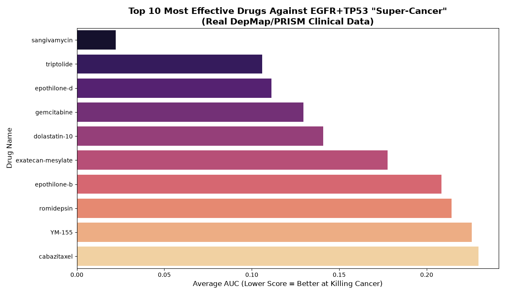

# Predicting Drug Resistance in Lung Cancer (NSCLC) 🧬

## Why I Built This

I built this project to see how machine learning can be applied on a real-world biological problem. Cancer drug resistance is a huge issue in clinical oncology, and I'm interested in seeing whether Python can effectively uncover the mechanisms through which resistance develops.

## What This Is
This project involves me building a custom training set out of genomic and pharmaceutical data to determine the ability of a Random Forest Regressor to predict resistance pathways in Non-Small Cell Lung Carcinoma (NSCLC).

## What This Isn't
This isn't a finished product. This is me experimenting in Python to see how effective an ML approach can be at finding interesting biological information.

## Building the Research Set
I gathered and cleaned the following official databases in Python:
GDSC2 (Genomics of Drug Sensitivity in Cancer) from the Wellcome Sanger Institute: Containing the IC50 values (drug resistances) for each cell line
Cosmic Cell Line Project: Containing the mutation sets for each cell line

## What This Found
I found that without requiring any biological information, the AI was successfully able to find known resistance pathways! The gene EGFR was found to be the main resistance pathway, which is correct as EGFR is the target of Erlotinib (an EGFR-inhibitor). The AI additionally found secondary resistance pathways, including the tumor-suppressor genes STK11 and TP53.

## Files

`analysis.py`: My Python script which merges the two sets of data and builds the Random Forest Regressor model, finding the most relevant genes. `master_research_data.csv`: The combined set of data relating NSCLC cell lines to their genetic mutations. `erlotinib_resistance_chart.png`: A bar chart displaying the top 10 most relevant genes discovered by the AI.

## PHASE 2: OVERCOMING DOUBLE-MUTATION DRUG RESISTANCE

**The Clinical Problem:**
While the AI correctly identified that EGFR mutations drive resistance to targeted therapies, the clinical reality is often more complicated. Some aggressive lung cancers present a "double mutation" where both the gas pedal (EGFR) is permanently engaged at the same time that the brakes (TP53) have been physically removed, making targeted treatments ineffective against "super cancer" cells that can ignore apoptosis signals.

**The Bioinformatics Solution:**
In order to find potential backup therapies, I created a Python data pipeline to find relevant hits in gigabytes of real-world clinical screening data from the Broad Institute's Cancer Dependency Map (DepMap) and PRISM repurposing datasets.

The pipeline:
1. Cross-referenced Hotspot and Damaging mutation matrices to mathematically find lung cancer cell lines that contain both an EGFR Hotspot mutation and a non-functional TP53 gene.
2. Standardized ID mismatches (PR- vs ACH-) between databases using an `OmicsProfiles` mapping dictionary.
3. Used Pandas `groupby()` and aggregation functions to calculate average AUC scores for thousands of clinical compounds screened against these double-mutant cancer cells, isolating the lowest AUC scores (most cytotoxic compounds).

**The Results:**

The clinical screening data perfectly validated the biological hypothesis—targeted therapies were not among the top drugs for treating this form of refractory lung cancer.

Instead, the results prove that heavily cytotoxic compounds are required to kill these double-mutant cancer cells by physically preventing cell division, DNA replication, or forcing apoptosis:

| Cell Skeleton Freezers (Microtubule Inhibitors) | DNA Shredders (Topoisomerase/DNA Synthesis Inhibitors) | p53-Bypass Compounds (Apoptosis Forcers) |
| :--- | :--- | :--- |
| Cabazitaxel | Gemcitabine | YM-155 |
| Epothilone-B/D | Exatecan-Mesylate | Romidepsin |
| | | Sangivamycin |

*Note: To run this file locally, you'll need to download the raw Broad Institute DepMap Public 26Q1 and PRISM Repurposing Secondary Screen `.csv` datasets into the project directory. They are too large to be uploaded to GitHub and are excluded by the `.gitignore` file.*
